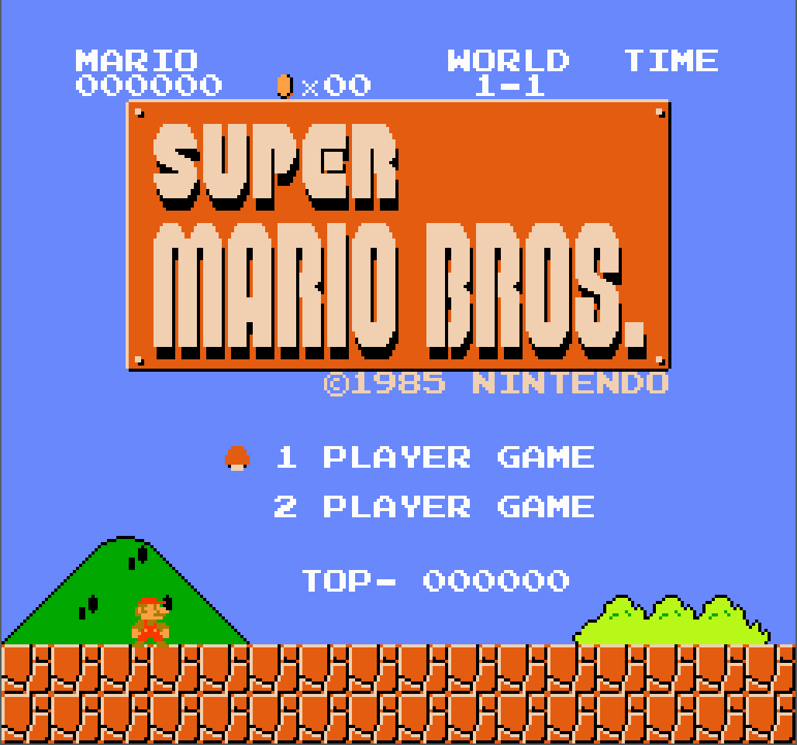
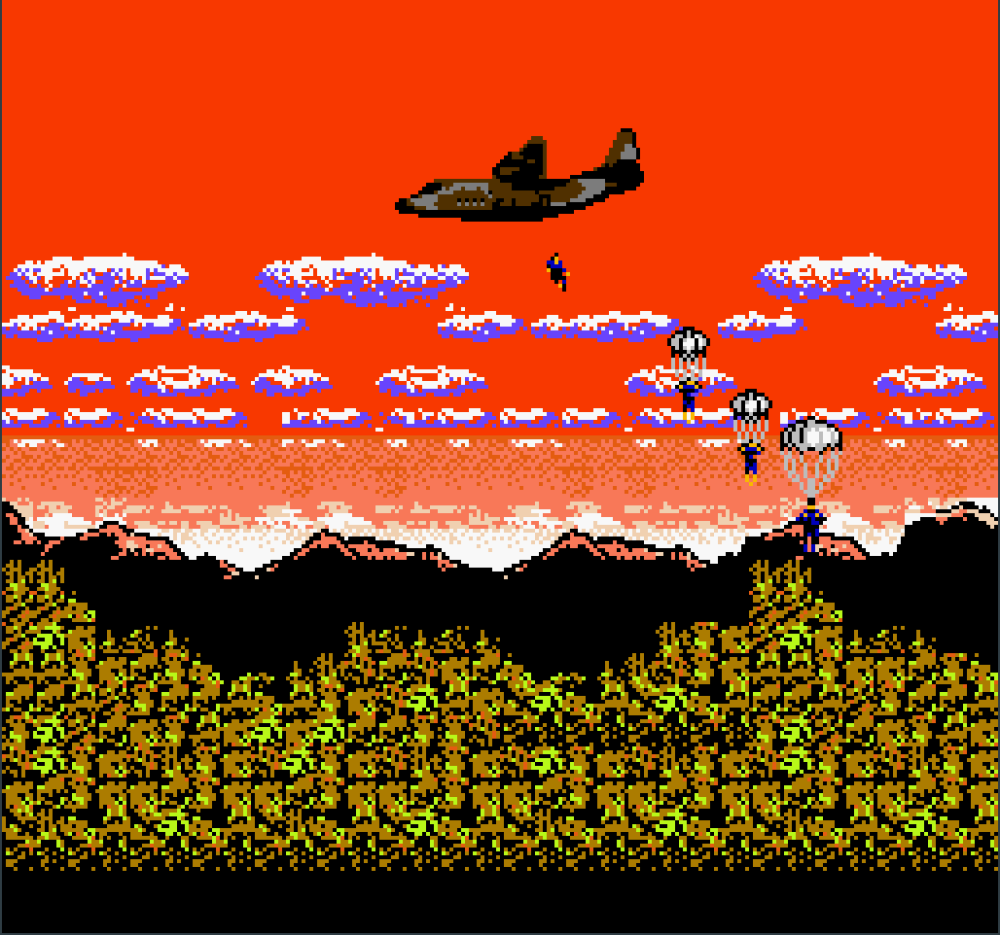
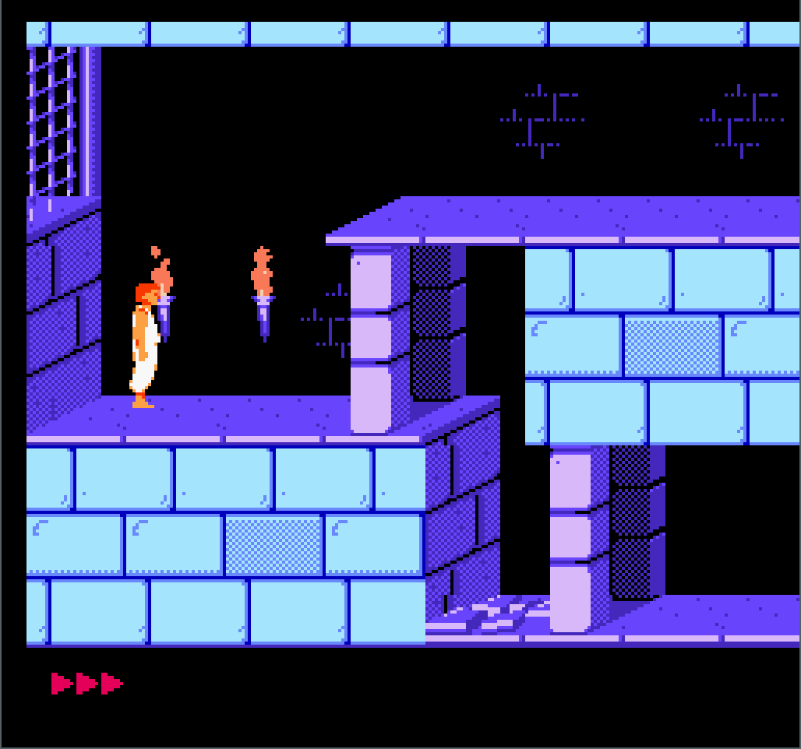

# nes-ml

  
  
  

A NES emulator from scratch in OCaml (and with sound). Still in development (see [development status](#development-status)).

## Build & Install

Assuming you have `opam` installed with an existing switch, either:
- add a pin to this repo: 
   > `opam pin add nes-ml https://github.com/Firobe/nes-ml.git`

- or clone and run
  > `opam install .`

This will fetch the libraries (two of them are unreleased and will need pins), build and install the emulator.
The executable name is `nes-ml`.

Note: I recommend using a build with `flambda` activated for more performance.

## Usage

Use : `nes-ml PATH_TO_ROM`  

### Controls (hard-coded)

| Function | Keyboard key |
| --- | --- |
| A button | S |
| B button | D |
| Left arrow | ← |
| Right arrow | → |
| Up arrow | ↑ |
| Down arrow | ↓ |
| Start | ⏎ (return) |
| Select | ⌫ (backspace) |
| Toggle GUI | Escape |
| Save state in slot `N` | `N` |
| Load state from slot `N` | Shift+`N` |
| Toggle debugging windows | Home |

Note that the `N` for save states must be 1, 2 or 3.

## Development status

- **Cycle-accurate CPU** (see [`6502-ml`](https://github.com/Firobe/6502-ml))
- **Cycle-accurate PPU** (graphics) (with rough edges)
- Partially implemented cycle-accurate **APU** (sound) (with rough edges)
- Multiple **save states**
- Implemented mappers: 0, 2
- Barebones GUI (with debugging windows showing the internal PPU state)
- Movie recording and replaying (in custom format with subframe precision)

## Next steps

- Implement headless backend for automatic tests
- Implement mappers 1, 4

## Based on

- separate CPU library: [`6502-ml`](https://github.com/Firobe/6502-ml)
- fixed-size int literals: [`stdint-literals`](https://github.com/Firobe/ocaml-stdint-literals)
